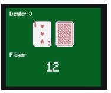

# RL-Agent-for-Blackjack

## Overview

This project implements a Reinforcement Learning (RL) agent to play the game of Blackjack using a Deep Q-Network (DQN). The agent learns to maximize its reward by interacting with the Blackjack environment provided by the `gymnasium` library. The goal is to achieve a sum of card values as close to 21 as possible without exceeding it, while also beating the dealer's hand.




## Problem Description

Blackjack is a popular casino card game where players compete against the dealer. The game uses a standard deck of cards, and the objective is to have a hand value closer to 21 than the dealer's hand without going over. The value of cards is as follows:

- Number cards (2-10) have their face value.
- Face cards (Jack, Queen, King) are worth 10.
- Aces can be worth either 1 or 11, depending on which value benefits the hand more.

The game can be modeled as a Markov Decision Process (MDP), where the state space includes the player's current sum, the dealer's face-up card, and whether the player holds a usable ace. The action space consists of two actions: **Hit** (take another card) or **Stick** (keep the current hand).

## Solution Approach

The solution involves implementing a DQN agent that approximates the Q-function using a neural network. The agent interacts with the environment, learns from its experiences, and updates its neural network to improve its decision-making over time.

### Key Components

1. **Environment Setup**: The Blackjack environment is created using the `gymnasium` library. The agent interacts with this environment to learn the optimal policy.
2. **Neural Network**: A neural network is used to approximate the Q-function. The network architecture consists of two hidden layers with ReLU activation and a linear output layer.
3. **Experience Replay**: The agent stores its experiences in a replay buffer and samples from it to update the neural network, which helps stabilize training.
4. **Exploration vs. Exploitation**: The agent balances exploration (random actions) and exploitation (actions based on the current Q-function) using an epsilon-greedy strategy.

## Implementation Details

### Dependencies

The project uses the following Python libraries:

- `gymnasium`: For creating and managing the Blackjack environment.
- `numpy`: For numerical computations.
- `tensorflow`: For building and training the neural network.
- `random`: For introducing randomness in the agent's actions.
- `matplotlib` and `seaborn`: For visualizing the results.

### Agent Architecture

The agent is implemented as a Python class with the following key methods:

- **Constructor**: Initializes the agent with parameters such as exploration rate, discount factor, and neural network architecture.
- **Choose Action**: Decides whether to explore (take a random action) or exploit (choose the best action based on the Q-function).
- **Update Experience**: Stores the agent's experiences in a replay buffer and updates the Q-function using the Bellman equation.
- **Update Neural Network**: Trains the neural network using a batch of experiences sampled from the replay buffer.

### Training Process

The agent is trained over 10,000 episodes. During each episode, the agent interacts with the environment, updates its experiences, and periodically trains the neural network. The exploration rate is decayed over time to shift from exploration to exploitation.

## Results

The performance of the agent is evaluated based on the following metrics:

- **Episode Rewards**: The cumulative reward obtained by the agent in each episode.
- **Episode Lengths**: The number of steps taken by the agent in each episode.
- **Training Error**: The error in the Q-function approximation during training.

The results are visualized using plots to show the agent's learning progress over time.


## Usage

To run the project, follow these steps:

1. Clone the repository:
   
   ```bash
   git clone https://github.com/your-username/RL-Agent-for-Blackjack.git
   cd RL-Agent-for-Blackjack
   ```

2. Install the required dependencies:
   
   ```bash
   pip install gymnasium numpy tensorflow collection 
   ```

3. Run the main script to train the agent:
   
   ```bash
   python main.py
   ```

4. After training, the results will be saved in the `results/` directory, including plots of the episode rewards, episode lengths, and training error.

## Future Work

- **Hyperparameter Tuning**: Experiment with different hyperparameters (e.g., learning rate, batch size) to improve the agent's performance.
- **Advanced Architectures**: Implement more advanced neural network architectures, such as Double DQN or Dueling DQN, to enhance the agent's learning capabilities.
- **Real-time Visualization**: Add real-time visualization of the agent's gameplay to better understand its decision-making process.

## 
